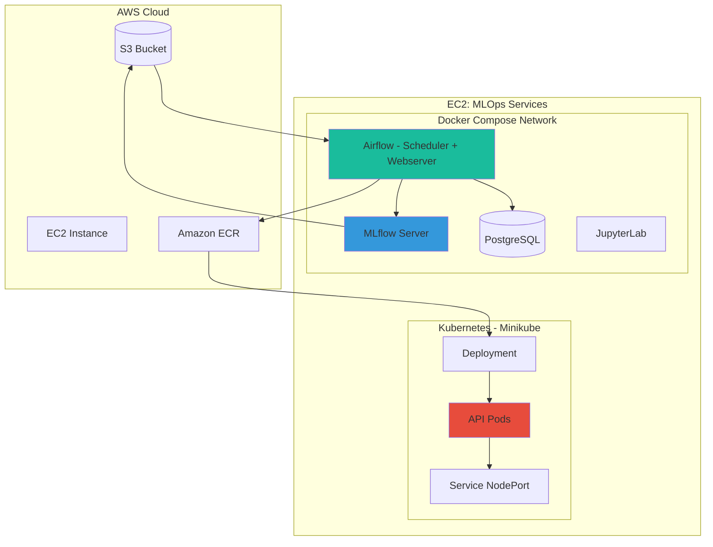
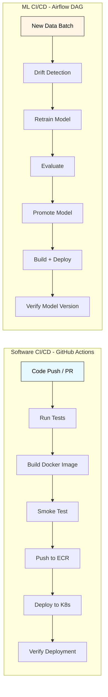
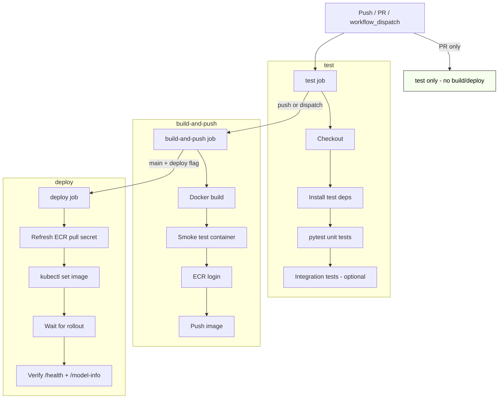

# Health Predict - System Architecture

## Overview

This document provides detailed technical architecture and implementation details for the Health Predict MLOps system.

## High-Level Architecture




## Component Architecture

### 1. Data Layer

#### S3 Storage Structure
```
s3://health-predict-mlops-{id}/
├── raw_data/
│   └── diabetic_data.csv                    # Original dataset
├── processed_data/
│   ├── initial_train.csv                    # 20% initial training
│   ├── initial_validation.csv               # Validation set
│   ├── initial_test.csv                     # Test set
│   └── future_data/                         # 80% for simulating batches
│       ├── batch_1.csv
│       ├── batch_2.csv
│       └── ...
├── drift_monitoring/
│   ├── cumulative_data/                     # Cumulative training data per batch
│   │   ├── train_batch5_*.csv
│   │   ├── val_batch5_*.csv
│   │   └── test_batch5_*.csv
│   └── reports/
│       ├── batch_1_drift_report.html
│       ├── batch_2_drift_report.html
│       └── ...
└── models/                                  # Model artifacts (via MLflow)
    └── {run_id}/
        ├── model/
        └── preprocessor/
```

### 2. Orchestration Layer (Airflow)

#### DAG: health_predict_continuous_improvement

**Purpose**: End-to-end pipeline for periodic retraining with drift detection

**Configuration**:
- Schedule: Manual trigger (periodic retraining)
- Max Active Runs: 1
- Catchup: False
- Tags: production, ci_cd, drift_monitoring

**Task Flow**:

```mermaid
graph LR
    start[Start] --> drift[run_drift_detection]
    drift --> prep[prepare_drift_aware_data]
    prep --> train[run_training_and_hpo]
    train --> eval[evaluate_model_performance]
    eval --> compare[compare_against_production]
    
    compare -->|Deploy| reg[register_and_promote_model]
    compare -->|Skip| notify_skip[notify_skip_deployment]
    
    reg --> build[build_api_image]
    build --> test[test_api_locally]
    test --> push[push_to_ecr]
    push --> deploy[deploy_to_kubernetes]
    deploy --> k8s_ready[check_kubernetes_readiness]
    k8s_ready --> verify[verify_deployment]
    verify --> health[post_deployment_health_check]
    health --> notify_success[notify_deployment_success]
    
    notify_skip --> end_skip[End]
    notify_success --> end_success[End]
```


**Key Tasks**:

1. **run_drift_detection** (PythonOperator)
   - Loads reference data (initial training set)
   - Loads current batch data
   - Runs Evidently AI drift detection
   - Generates HTML report → S3
   - Logs metrics to MLflow
   - Returns: drift metrics (share, columns, detected)

2. **prepare_drift_aware_data** (PythonOperator)
   - Loads all batches up to current
   - Applies feature engineering
   - Creates cumulative train/val/test splits
   - Uploads to S3
   - Returns: S3 keys for train/val/test data

3. **run_training_and_hpo** (BashOperator)
   - Calls `scripts/train_model.py`
   - Ray Tune HPO with ASHA scheduler
   - Trains XGBoost with best hyperparameters
   - Logs to MLflow experiment
   - Returns: run_id, metrics

4. **evaluate_model_performance** (PythonOperator)
   - Loads model from MLflow
   - Evaluates on validation set
   - Calculates AUC, precision, recall, F1
   - Logs evaluation metrics
   - Returns: performance metrics

5. **compare_against_production** (PythonOperator)
   - Loads production model (if exists)
   - Evaluates both on temporal test set
   - Compares AUC scores
   - Decision: Deploy if (new_auc - prod_auc) > REGRESSION_THRESHOLD
   - Returns: decision (DEPLOY/SKIP)

6. **register_and_promote_model** (PythonOperator)
   - Archives old Production model
   - Registers new model version
   - Promotes to Production stage
   - Returns: model_name, model_version, run_id

7. **build_api_image** (PythonOperator)
   - Generates Docker image tag (v{version}-{timestamp})
   - Builds image with MODEL_NAME build arg
   - Tags for ECR
   - Returns: image_tag, full_image_name

8. **test_api_locally** (BashOperator)
   - Runs container locally
   - Tests /health and /predict endpoints
   - Validates responses
   - Stops container

9. **push_to_ecr** (BashOperator)
   - Authenticates with ECR
   - Pushes Docker image
   - Verifies push success

10. **deploy_to_kubernetes** (Bash Operator)
    - Updates K8s deployment manifest with new image
    - Applies rolling update
    - Returns: deployment status

11. **check_kubernetes_readiness** (PythonOperator)
    - Verifies K8s cluster access
    - Checks Minikube status
    - Retries with exponential backoff
    - Attempts to start Minikube if down

12. **verify_deployment** (PythonOperator) ⭐ NEW
    - Checks rollout status
    - Verifies pod readiness
    - **Queries /model-info endpoint**
    - **Compares deployed model version with promoted version**
    - **Fails if mismatch detected**
    - Returns: deployment verification status

13. **post_deployment_health_check** (BashOperator)
    - Extended health verification
    - Checks all API endpoints
    - Validates response times

### 3. Experiment Tracking (MLflow)

#### Architecture

```
MLflow Server (Port 5000)
├── Backend Store: PostgreSQL
│   ├── Experiments metadata
│   ├── Runs metadata
│   ├── Parameters
│   ├── Metrics
│   └── Tags
├── Artifact Store: S3
│   ├── Models
│   ├── Preprocessors
│   └── Custom artifacts
└── Model Registry
    ├── Registered Models
    ├── Model Versions
    └── Stage transitions
```

#### Experiments

**1. HealthPredict_Training_HPO_Airflow** (ID: 1)
- Purpose: Model training and HPO experiments
- Logged by: `run_training_and_hpo` task
- Metrics: train_auc, val_auc, best_auc, test_auc
- Parameters: All Ray Tune hyperparameters
- Artifacts: model/, preprocessor/

**2. HealthPredict_Drift_Monitoring** (ID: 2)
- Purpose: Drift detection monitoring
- Logged by: `run_drift_detection` task
- Metrics: drift_share, n_drifted_columns, dataset_drift
- Artifacts: drift_report.html
- Tags: batch_number

#### Model Registry

**Model**: HealthPredictModel
- Versions: 1, 2, 3, ..., 9 (current Production)
- Stages: 
  - **Production**: Version 9 (Batch 5)
  - **Archived**: Versions 1-8
- Metadata: run_id, creation_timestamp, description

### 4. Training Pipeline

#### Ray Tune HPO Configuration

```python
config = {
    "max_depth": tune.randint(3, 10),
    "learning_rate": tune.loguniform(0.001, 0.3),
    "n_estimators": tune.randint(50, 300),
    "min_child_weight": tune.randint(1, 10),
    "subsample": tune.uniform(0.6, 1.0),
    "colsample_bytree": tune.uniform(0.6, 1.0),
    "gamma": tune.uniform(0, 5),
    "reg_alpha": tune.loguniform(0.001, 10),
    "reg_lambda": tune.loguniform(0.001, 10)
}

# Scheduler: ASHA (Asynchronous Successive Halving Algorithm)
scheduler = ASHAScheduler(
    metric="val_auc",
    mode="max",
    max_t=MAX_EPOCHS,
    grace_period=GRACE_PERIOD,
    reduction_factor=2
)

# Search: 1 sample, 1 epoch (fast for demo)
analysis = tune.run(
    train_xgboost,
    config=config,
    num_samples=RAY_NUM_SAMPLES,  # 1 for lightweight
    scheduler=scheduler,
    resources_per_trial={"cpu": 2}
)
```

#### Feature Engineering Pipeline

**Input Features** (from diabetic dataset):
- Numerical: time_in_hospital, num_lab_procedures, num_procedures, num_medications, etc.
- Categorical: race, gender, age (binned), admission_type_id, discharge_disposition_id, etc.

**Preprocessing Steps**:
1. Clean data (handle '?', missing values)
2. Filter expired/hospice patients
3. Create `readmitted_binary` target (NO → 0, <30/> 30 → 1)
4. Convert age brackets to ordinal
5. Drop high-cardinality features (diag_1, diag_2, diag_3)
6. One-hot encode categorical features
7. Standard scale numerical features

**Output**: Preprocessed feature matrix (sparse, ~150 features after OHE)

### 5. Deployment Pipeline

#### Docker Image Build

**Dockerfile**:
```dockerfile
FROM python:3.10-slim
WORKDIR /app
COPY src/api/requirements.txt .
RUN pip install--no-cache-dir -r requirements.txt
COPY src ./src
ENV MODEL_NAME=HealthPredictModel
ENV MODEL_STAGE=Production
ENV MLFLOW_TRACKING_URI=http://mlflow:5000
CMD ["uvicorn", "src.api.main:app", "--host", "0.0.0.0", "--port", "8000"]
```

**Build Args**:
- `MODEL_NAME`: HealthPredictModel (default)
- Baked into image for portability

**Image Tagging**:
- Format: `{ECR_REGISTRY}/health-predict-api:v{model_version}-{timestamp}`
- Example: `692133751630.dkr.ecr.us-east-1.amazonaws.com/health-predict-api:v9-1765946226`

#### Kubernetes Deployment

**Manifest** (k8s/deployments/health-predict-api.yaml):
```yaml
apiVersion: apps/v1
kind: Deployment
metadata:
  name: health-predict-api-deployment
spec:
  replicas: 1
  selector:
    matchLabels:
      app: health-predict-api
  template:
    metadata:
      labels:
        app: health-predict-api
    spec:
      containers:
      - name: health-predict-api
        image: {ECR_REGISTRY}/health-predict-api:v9-1765946226
        ports:
        - containerPort: 8000
        env:
        - name: MLFLOW_TRACKING_URI
          value: "http://mlflow:5000"
        livenessProbe:
          httpGet:
            path: /health
            port: 8000
          initialDelaySeconds: 30
          periodSeconds: 10
        readinessProbe:
          httpGet:
            path: /health
            port: 8000
          initialDelaySeconds: 10
          periodSeconds: 5
---
apiVersion: v1
kind: Service
metadata:
  name: health-predict-api-service
spec:
  type: NodePort
  selector:
    app: health-predict-api
  ports:
  - protocol: TCP
    port: 8000
    targetPort: 8000
    nodePort: 31780
```

**Rolling Update Strategy**:
- `maxSurge`: 1
- `maxUnavailable`: 0
- Zero-downtime deployments

### 6. API Service

#### FastAPI Application Structure

```python
# src/api/main.py

# Global state
model = None
preprocessor = None
model_metadata = {}

@app.on_event("startup")
async def load_model_on_startup():
    """Load model and preprocessor from MLflow on startup"""
    global model, preprocessor, model_metadata
    
    # Load production model
    model_uri = f"models:/{MODEL_NAME}/{MODEL_STAGE}"
    model = mlflow.xgboost.load_model(model_uri)
    
    # Load preprocessor
    preprocessor = mlflow.sklearn.load_model(f"{model_uri}/preprocessor")
    
    # Store metadata
    model_metadata = {
        "model_name": MODEL_NAME,
        "model_version": str(version.version),
        "model_stage": MODEL_STAGE,
        "run_id": run_id,
        "loaded_at": datetime.utcnow().isoformat()
    }

@app.get("/health")
async def health_check():
    """Health check for K8s probes"""
    return {
        "status": "healthy",
        "model_loaded": model is not None,
        "preprocessor_loaded": preprocessor is not None
    }

@app.get("/model-info")
async def model_info():
    """Return model metadata for version verification"""
    if not model_metadata:
        raise HTTPException(status_code=503, ...)
    return model_metadata

@app.post("/predict")
async def predict(input_data: PatientData):
    """Generate readmission prediction"""
    # Convert Pydantic model to DataFrame
    # Apply preprocessing
    # Get prediction
    # Return result with model version
```

#### API Endpoints

| Endpoint | Method | Purpose | Response |
|----------|--------|---------|----------|
| `/health` | GET | K8s probes | Health status |
| `/model-info` | GET | Version verification | Model metadata |
| `/predict` | POST | Prediction | Risk + probability |
| `/docs` | GET | Swagger UI | API documentation |
| `/redoc` | GET | ReDoc | Alternative docs |

### 7. Monitoring & Drift Detection

#### Evidently AI Integration

**Drift Detection Flow**:
```python
# 1. Load reference (initial training data)
reference_data = load_from_s3(INITIAL_TRAIN_KEY)

# 2. Load current batch
current_data = load_from_s3(f"batch_{batch_number}.csv")

# 3. Exclude non-feature and high-cardinality columns
exclude_cols = ['encounter_id', 'patient_nbr', 'readmitted', 'readmitted_binary',
                'diag_1', 'diag_2', 'diag_3']  # ICD-9 codes too high-cardinality for chi-squared

# 4. Prepare categorical columns (fillna, cast to str)
for col in object_columns:
    ref_features[col] = ref_features[col].fillna('Unknown').astype(str)

# 5. Run drift detection (~44 features: 11 numeric + 33 categorical)
drift_report = Report(metrics=[DataDriftPreset()])
drift_report.run(reference_data=ref_features, current_data=new_features)

# 6. Extract metrics
drift_share = result["share_of_drifted_columns"]  # KS-test (numeric), chi-squared (categorical)
dataset_drift = result["dataset_drift"]

# 7. Drift gate decision
if drift_share > DRIFT_THRESHOLD or force_retrain:
    proceed_to_retraining()
else:
    skip_retraining()  # No drift detected, production model maintained
```

**Drift Metrics**:
- **Drift Share**: Percentage of features showing distribution drift
- **Threshold**: 30% drift share (gating — controls retraining)
- **Numeric Features**: 11 features tested via KS-test (p-value < 0.05)
- **Categorical Features**: 33 features tested via chi-squared test

**Drift-Aware Batch Examples**:
- Batch 1 (no drift): drift_share ~27%, 12/44 features → **Skip retraining**
- Batch 4 (strong drift): drift_share ~34%, 15/44 features → **Retrain**

### 8. Quality Gates

#### Three-Stage Quality Assurance

**Stage 1: Drift Detection** (Gating)
- Purpose: Gate retraining based on data distribution changes
- Method: KS-test (numeric) + chi-squared (categorical) via Evidently AI
- Threshold: 30% drift share
- Action: If drift detected → proceed to retraining. If not → skip to end.
- Override: `force_retrain` DAG config parameter bypasses drift gate
- Rationale: No need to retrain when data distribution is stable

**Stage 2: Regression Guardrail** (Gating)
- Purpose: Prevent model performance degradation
- Metric: AUC on temporal test set
- Threshold: -0.02 (allow max 2% AUC regression)
- Logic: `if (new_auc - prod_auc) > REGRESSION_THRESHOLD: DEPLOY`
- Action: Branch to DEPLOY or SKIP

**Stage 3: Model Version Verification** (Gating)
- Purpose: Ensure correct model deployed
- Method: Query `/model-info`, compare with promoted version
- Check: `deployed_version == promoted_version AND deployed_run_id == promoted_run_id`
- Action: Fail deployment if mismatch

## Network Architecture

```
Docker Compose Network: mlops_network (bridge)
├── Airflow Scheduler: airflow-scheduler-1
├── Airflow Webserver: airflow-webserver-1
├── MLflow Server: mlflow-1
├── PostgreSQL: postgres-1
└── JupyterLab: jupyterlab-1

Minikube Network: minikube (bridge)
└── health-predict-api pods

Host Network:
├── Port 8080 → Airflow Webserver
├── Port 5000 → MLflow Server
├── Port 8888 → JupyterLab
└── Port {minikube_ip}:31780 → API Service (NodePort)
```

## Data Flow

### Training Flow
```
S3 Batch Data
    ↓ (download)
Airflow Task
    ↓ (feature engineering)
Preprocessed Features
    ↓ (Ray Tune HPO)
Trained Model
    ↓ (log)
MLflow Experiment
    ↓ (register)
MLflow Model Registry
    ↓ (promote)
Production Stage
```

### Deployment Flow
```
MLflow Production Model
    ↓ (retrieve)
Docker Build Context
    ↓ (build image)
ECR Registry
    ↓ (pull)
Kubernetes Deployment
    ↓ (rolling update)
Running API Pods
    ↓ (verify)
Model Version Check ✅
```

### Prediction Flow
```
User Request
    ↓ (POST /predict)
FastAPI Endpoint
    ↓ (validate)
Pydantic Model
    ↓ (transform to DataFrame)
Preprocessor Pipeline
    ↓ (predict)
XGBoost Model
    ↓ (format response)
JSON Response with Version
```

## CI/CD Pipeline Architecture

### Dual-Pipeline Design

Health Predict uses two complementary CI/CD pipelines:



| Pipeline | Trigger | Scope |
|----------|---------|-------|
| GitHub Actions | Code changes, manual dispatch | Code testing, image build, infrastructure deploy |
| Airflow DAG | Data batch arrival, manual trigger | Drift detection, model training, model deploy |

### GitHub Actions Workflow

**File**: `.github/workflows/ci-cd.yml`



### Self-Hosted Runner

The GitHub Actions runner runs directly on the EC2 instance as a systemd service:

```
EC2 Instance
├── GitHub Actions Runner (systemd)
│   └── Has access to:
│       ├── Docker daemon (build images, run containers)
│       ├── Minikube cluster (kubectl, deploy)
│       ├── AWS CLI (ECR push, S3 access)
│       └── MLOps Docker network (smoke tests)
├── Docker Compose (Airflow, MLflow, PostgreSQL)
└── Minikube (API pods)
```

The runner is registered with labels `self-hosted,linux,x64,ec2,mlops` and starts automatically on boot.

## Security Considerations

- **AWS Credentials**: EC2 instance role (avoid hardcoded keys)
- **Kubernetes Access**: Minikube config mounted read-only (chmod 644)
- **API Authentication**: Not implemented (demo system)
- **Model Artifacts**: Private S3 bucket
- **Container Registry**: Private ECR
- **Database**: PostgreSQL with password (Docker secrets recommended for production)

## Scalability Considerations

- **Airflow**: Can scale workers horizontally with CeleryExecutor
- **MLflow**: Backend DB can scale to PostgreSQL cluster
- **Kubernetes**: Minikube for demo, production should use EKS/GKE
- **Ray Tune**: Can scale to Ray cluster for larger HPO
- **API**: Horizontal pod autoscaling based on CPU/memory

## Cost Optimization

- **EC2**: t3.large (2 vCPU, 8GB RAM) - ~$60/month
- **S3**: Standard storage, lifecycle policies for old artifacts
- **ECR**: 500MB free tier, image cleanup policies
- **Minikube**: Local K8s, no EKS cost (~$70/month savings)
- **Shutdown**: Stop EC2 instance when not in use

## Performance Benchmarks

- **Training Time**: ~2-3 minutes for 1 Ray Tune trial, 1 epoch
- **Deployment Time**: ~45 seconds (build + push + deploy)
- **API Latency**: ~50ms for single prediction (p50)
- **Drift Detection**: ~10 seconds for 11 features, ~14K reference samples
- **End-to-End Pipeline**: ~6 minutes (drift → deploy → verify)

---

**Last Updated:** December 2025  
**Version:** 2.0 (with model version verification)
