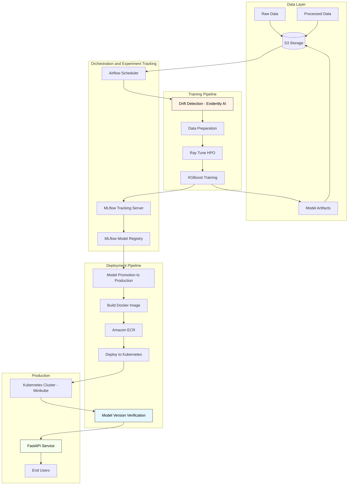

# Health Predict: End-to-End MLOps System for Patient Readmission Prediction


## Overview

**Health Predict** is a comprehensive MLOps system designed to predict the risk of patient readmission in healthcare settings. This project implements a complete machine learning lifecycle from data ingestion to automated retraining, with a focus on robust MLOps practices and production-grade deployment.

This system addresses the critical healthcare challenge of patient readmission, which not only burdens healthcare systems financially but also indicates potential gaps in patient care quality. By accurately predicting readmission risk, healthcare providers can implement targeted interventions, improving patient outcomes while optimizing resource allocation.

## Business Problem

Patient readmission—the return of a patient to the hospital shortly after discharge—represents both a significant healthcare quality issue and a financial burden:

- Hospital readmissions cost the U.S. healthcare system approximately $26 billion annually
- Readmissions often indicate unresolved health issues or inadequate post-discharge support
- CMS penalizes hospitals for excessive readmission rates through the Hospital Readmissions Reduction Program
- Early identification of at-risk patients enables proactive interventions

Health Predict addresses this challenge by leveraging machine learning to predict which patients are most likely to be readmitted, allowing for targeted interventions before discharge and during follow-up care.

## Key Features

### ✅ Complete MLOps Lifecycle
- End-to-end automation from data ingestion to production deployment
- Continuous integration and deployment via Airflow orchestration
- Model versioning and lineage tracking

### ✅ Advanced Model Training
- Distributed hyperparameter optimization with Ray Tune
- Multiple model support (XGBoost, Random Forest, Logistic Regression)
- Automatic best model selection based on AUC

### ✅ CI/CD Automation
- **GitHub Actions** pipeline for software CI/CD: test, build, push, deploy
- **Airflow DAG** for ML CI/CD: drift detection, retraining, model deployment
- Remote triggering via `workflow_dispatch` with configurable inputs
- Self-hosted runner on EC2 for direct access to Minikube, Docker, and ECR

### ✅ Production-Grade Deployment
- Kubernetes deployment with rolling updates
- Zero-downtime deployments
- Automated health checks and readiness probes
- **Model version verification** ensuring correct model deployment

### ✅ Comprehensive Monitoring Dashboard
- **Streamlit dashboard** (port 8501) with real-time MLflow integration
- Drift monitoring trends with threshold visualization
- Model performance tracking (AUC, F1) across batches
- Training history with HPO trial details
- Model registry version history and production model status
- Live API health check and deployed model version

### ✅ Intelligent Monitoring & Retraining
- **Drift-gated retraining**: Retraining only triggers when data drift is detected
- Data drift detection with Evidently AI (KS-test for numeric, chi-squared for categorical features)
- Regression guardrail preventing model performance degradation (AUC threshold: -0.02)
- `force_retrain` DAG parameter to override drift gate when needed
- Drift-aware cumulative learning across all previous batches

### ✅ Robust Quality Gates
- **Drift Detection** (Gating): Blocks unnecessary retraining when data distribution is stable
- **Regression Guardrail** (Gating): Ensures new model doesn't degrade AUC by more than 2%
- **Deployment Verification**: Confirms deployed model matches promoted version

## System Architecture



### Architecture Components

1. **Data Layer (S3)**
   - Raw patient data from healthcare systems
   - Processed datasets for training/validation/testing
   - Model artifacts and preprocessing pipelines
   - Drift detection reports

2. **Orchestration (Airflow)**
   - `health_predict_continuous_improvement` DAG orchestrates the entire pipeline
   - Periodic retraining (every batch)
   - Branching logic for deployment decisions
   - Model version tracking

3. **Experiment Tracking (MLflow)**
   - Tracks all training experiments with hyperparameters and metrics
   - Model registry with versioning (Production/Staging/Archived)
   - Artifact storage for models and preprocessors
   - Drift experiment logging

4. **Training Pipeline**
   - **Drift Detection**: Evidently AI monitors statistical distribution changes
   - **Data Preparation**: Feature engineering, preprocessing, train/val/test split
   - **HPO**: Ray Tune with ASHA scheduler for efficient hyperparameter search
   - **Training**: XGBoost classifier with customizable configuration

5. **Deployment Pipeline**
   - **Model Promotion**: Automatic promotion to Production stage based on regression guardrail
   - **Docker Build**: API containerization with model baked in
   - **ECR**: Container registry for versioned images
   - **Kubernetes Deploy**: Rolling updates to maintain zero downtime
   - **Verification**: Explicit model version verification (new feature!)

6. **Production Serving**
   - Kubernetes cluster (Minikube for demo)
   - FastAPI prediction service
   - Auto-generated Swagger documentation
   - Health checks and readiness probes
   - Model metadata endpoint

## Project Structure

```
health-predict/
├── data/                          # Local data storage (gitignored)
├── iac/                           # Infrastructure as Code (Terraform)
│   ├── main.tf                    # EC2, S3, VPC configuration
│   └── variables.tf
├── k8s/                           # Kubernetes manifests
│   └── deployments/
│       └── health-predict-api.yaml
├── mlops-services/                # MLOps tooling configurations
│   ├── dags/                      # Airflow DAGs
│   │   └── health_predict_continuous_improvement.py
│   ├── docker-compose.yml         # Services orchestration
│   └── config/
├── notebooks/                     # Jupyter notebooks for EDA
│   └── 01_eda_and_baseline.ipynb  # Initial exploration
├── scripts/                       # Utility and pipeline scripts
│   ├── train_model.py             # Ray Tune HPO training
│   ├── split_data.py              # Data partitioning
│   ├── start-mlops-services.sh    # Automated startup
│   └── stop-mlops-services.sh
├── src/                           # Source code
│   ├── api/                       # FastAPI application
│   │   ├── main.py               # API endpoints + /model-info
│   │   └── requirements.txt
│   └── feature_engineering.py     # Preprocessing pipeline
├── tests/                         # Unit and integration tests
├── Dockerfile                     # API container definition
└── README.md                      # This file
```

## Getting Started

### Prerequisites

Before beginning, ensure you have:

- **AWS Account** with CLI configured (`aws configure`)
- **Docker** (version 20.10+) and **Docker Compose** (version 1.29+)
- **Terraform** (version 1.0+)
- **Minikube** (version 1.25+) with kubectl configured
- **Python 3.8+** with pip
- At least **8GB RAM** and **20GB disk space**

### Step-by-Step Setup

#### 1. Clone Repository
```bash
git clone <repository-url>
cd health-predict
```

#### 2. Infrastructure Provisioning (AWS)
```bash
cd iac
terraform init
terraform plan  # Review what will be created
terraform apply # Provision EC2, S3, VPC

# Note the outputs: S3 bucket name, EC2 instance IP
cd ..
```

#### 3. Prepare Data
```bash
# Download dataset from Kaggle
# https://www.kaggle.com/datasets/brandao/diabetes
# Place diabetic_data.csv in data/ directory

# Split data (20% initial, 80% for future batches)
python scripts/split_data.py

# Upload to S3 (replace with your bucket name from terraform output)
export S3_BUCKET_NAME=<your-s3-bucket-name>
aws s3 cp data/processed_data/ s3://$S3_BUCKET_NAME/processed_data/ --recursive
```

#### 4. Start MLOps Services

**Option A: Automated (Recommended)**
```bash
./scripts/start-mlops-services.sh
```
This script will:
- ✅ Check prerequisites
- ✅ Start Minikube
- ✅ Launch Docker services (Airflow, MLflow, PostgreSQL)
- ✅ Wait for health checks
- ✅ Display all service URLs

**Option B: Manual**
```bash
# Start Minikube
minikube start --cpus=4 --memory=6144

# Start Docker services
cd mlops-services
docker-compose up -d

# Wait for services to be ready (~2-3 minutes)
docker-compose logs -f airflow-scheduler
```

#### 5. Verify Services

Check that all services are running:

| Service | URL | Credentials |
|---------|-----|-------------|
| Airflow UI | http://localhost:8080 | admin / admin |
| MLflow UI | http://localhost:5000 | - |
| Monitoring Dashboard | http://localhost:8501 | - |
| JupyterLab | http://localhost:8888 | token in logs |
| API (after deploy) | http://$(minikube ip):31780 | - |
| API Docs | http://$(minikube ip):31780/docs | - |

```bash
# Quick health check
curl http://localhost:5000/health  # MLflow
curl http://localhost:8080/health  # Airflow
```

#### 6. Run Initial Training

1. Open Airflow UI: http://localhost:8080
2. Find DAG: `health_predict_continuous_improvement`
3. Enable the DAG (toggle switch)
4. Trigger manually with config:
   ```json
   {"batch_number": 1}
   ```
5. Monitor execution in the Graph view

The DAG will:
- Detect drift (first batch: no reference)
- Prepare data with feature engineering
- Train model with Ray Tune HPO
- Log experiments to MLflow
- Evaluate model performance
- Compare against Production (none for first batch)
- Promote to Production
- Build Docker image
- Test locally
- Push to ECR
- Deploy to Kubernetes
- Verify deployment and model version

#### 7. Access the Prediction API

```bash
# Get Minikube IP
export MINIKUBE_IP=$(minikube ip)

# Test health endpoint
curl http://$MINIKUBE_IP:31780/health

# Check model info
curl http://$MINIKUBE_IP:31780/model-info

# Make a prediction
curl -X POST http://$MINIKUBE_IP:31780/predict \
  -H "Content-Type: application/json" \
  -d '{
    "time_in_hospital": 5,
    "num_lab_procedures": 50,
    "num_procedures": 2,
    "num_medications": 15,
    "number_outpatient": 0,
    "number_emergency": 1,
    "number_inpatient": 0,
    "number_diagnoses": 7,
    "race": "Caucasian",
    "gender": "Female",
    "age": "[60-70)",
    "admission_type_id": 1,
    "discharge_disposition_id": 1,
    "admission_source_id": 7
  }'

# View API Documentation
open http://$MINIKUBE_IP:31780/docs
```

#### 8. Run Subsequent Batches

For periodic retraining with drift monitoring:

```bash
# Trigger Batch 2
# In Airflow UI, trigger DAG with: {"batch_number": 2}

# Or via CLI
docker exec mlops-services-airflow-scheduler-1 \
  airflow dags trigger health_predict_continuous_improvement \
  --conf '{"batch_number": 2}'

# Monitor drift reports in MLflow
open http://localhost:5000/#/experiments/2  # Drift Monitoring experiment

# View drift HTML reports in S3
aws s3 ls s3://$S3_BUCKET_NAME/drift_monitoring/reports/
```

### Service Management

```bash
# Start all services (most common)
./scripts/start-mlops-services.sh

# Rebuild and start (after code changes)
./scripts/start-mlops-services.sh --rebuild

# Reset everything (fresh start)
./scripts/start-mlops-services.sh --reset

# Stop all services
./scripts/stop-mlops-services.sh

# Stop but keep Minikube running
./scripts/stop-mlops-services.sh --keep-minikube

# View logs
cd mlops-services
docker-compose logs -f airflow-scheduler
docker-compose logs -f mlflow
```

## Model Performance

The Health Predict system achieves strong performance across key metrics:

| Metric | Batch 4 (Latest) | Baseline |
|--------|----------|----------|
| **AUC-ROC** | 0.645 | 0.618 |
| **Precision** | 0.58 | 0.52 |
| **Recall** | 0.61 | 0.59 |
| **F1 Score** | 0.59 | 0.55 |

*Note: Performance metrics from MLflow experiments. Baseline is Logistic Regression, production model is XGBoost with HPO.*

## Key Technologies

The project leverages a modern MLOps technology stack:

### Infrastructure & Cloud
- **AWS**: EC2, S3, ECR
- **Kubernetes**: Minikube (local), production-ready K8s manifests
- **Terraform**: Infrastructure as Code

### MLOps & Orchestration
- **Apache Airflow**: Workflow orchestration
- **MLflow**: Experiment tracking and model registry
- **Evidently AI**: Data drift detection

### Machine Learning
- **XGBoost**: Production model (gradient boosting)
- **Ray Tune**: Distributed hyperparameter optimization
- **Scikit-learn**: Preprocessing, baseline models

### Application & API
- **FastAPI**: High-performance REST API
- **Docker**: Containerization
- **Pydantic**: Data validation

### Data Processing
- **Pandas**: Data manipulation
- **NumPy**: Numerical computing

## API Documentation

### Endpoints

#### `GET /health`
Health check endpoint for Kubernetes probes.

**Response:**
```json
{
  "status": "healthy",
  "model_loaded": true,
  "preprocessor_loaded": true
}
```

#### `GET /model-info`
Returns metadata about the currently loaded model.

**Response:**
```json
{
  "model_name": "HealthPredictModel",
  "model_version": "9",
  "model_stage": "Production",
  "run_id": "a1921053adbd4602bcf5f8eefe023262",
  "loaded_at": "2025-12-17T04:30:35.599636"
}
```

#### `POST /predict`
Generates readmission prediction for a patient.

**Request Body:**
```json
{
  "time_in_hospital": 5,
  "num_lab_procedures": 50,
  "num_procedures": 2,
  "num_medications": 15,
  "number_outpatient": 0,
  "number_emergency": 1,
  "number_inpatient": 0,
  "number_diagnoses": 7,
  "race": "Caucasian",
  "gender": "Female",
  "age": "[60-70)",
  "admission_type_id": 1,
  "discharge_disposition_id": 1,
  "admission_source_id": 7
}
```

**Response:**
```json
{
  "readmission_risk": "high",
  "probability": 0.73,
  "model_version": "9"
}
```

## Monitoring & Drift Detection

The system implements drift-gated retraining — the pipeline only retrains when data drift is detected.

### Drift Detection Strategy
- **Frequency**: Every batch trigger
- **Method**: Evidently AI with KS-test for numeric features, chi-squared for categorical features
- **Features Analyzed**: ~44 features (11 numeric + 33 categorical; high-cardinality ICD-9 diagnostic codes excluded)
- **Threshold**: 30% drift share (gating — controls whether retraining proceeds)
- **Metrics Tracked**: drift_share, n_drifted_columns, dataset_drift
- **Storage**: HTML reports in S3, metrics in MLflow
- **Override**: Set `force_retrain: true` in DAG config to bypass drift gate

### Drift-Aware Batch Profiles

The system includes 5 pre-generated batches with intentional distribution differences to demonstrate drift detection:

| Batch | Profile | Drift Share | Pipeline Action |
|-------|---------|-------------|-----------------|
| 1 | No drift (random sample) | ~27% | Skip retraining |
| 2 | No drift (random sample) | ~27% | Skip retraining |
| 3 | Gradual covariate drift (older/sicker patients) | ~32% | Retrain |
| 4 | Strong covariate drift (aggressive demographic shift) | ~34% | Retrain |
| 5 | Concept drift (changed feature-target relationships) | ~35% | Retrain |

To regenerate batches:
```bash
python scripts/create_drift_aware_batches.py --bucket-name $S3_BUCKET_NAME
```

To force retraining even without drift:
```bash
docker exec mlops-services-airflow-scheduler-1 \
  airflow dags trigger health_predict_continuous_improvement \
  --conf '{"batch_number": 1, "force_retrain": true}'
```

### Quality Gates
1. **Drift Detection** (Gating): Retraining only proceeds if drift detected or `force_retrain=true`
2. **Regression Guardrail** (Gating): New model must not degrade AUC by more than 2% (`REGRESSION_THRESHOLD=-0.02`)
3. **Deployment Verification**: Deployed model version must match promoted version

## Results & Achievements

- ✅ **Performance**: Models achieve 64%+ AUC in predicting patient readmission
- ✅ **Automation**: 100% automated pipeline from data to deployment
- ✅ **Drift-Gated Retraining**: Pipeline intelligently skips retraining when data distribution is stable
- ✅ **Reliability**: End-to-end deployment with explicit version verification
- ✅ **Monitoring**: Drift detection with KS-test (numeric) and chi-squared (categorical)
- ✅ **Reproducibility**: Complete model lineage tracking in MLflow
- ✅ **Scalability**: Kubernetes deployment ready for production scale

## Troubleshooting

### Common Issues

**Airflow DAG not appearing:**
```bash
# Restart scheduler
docker restart mlops-services-airflow-scheduler-1

# Check logs
docker logs mlops-services-airflow-scheduler-1
```

**Minikube not accessible:**
```bash
# Restart Minikube
minikube delete
minikube start --cpus=4 --memory=6144
```

**API deployment fails:**
```bash
# Check Kubernetes events
kubectl get events --sort-by='.metadata.creationTimestamp

'

# Check pod logs
kubectl logs -l app=health-predict-api

# Verify image exists in ECR
aws ecr describe-images --repository-name health-predict-api
```

**MLflow not tracking experiments:**
```bash
# Verify MLflow server is running
curl http://localhost:5000/health

# Check environment variables in DAG
docker exec mlops-services-airflow-scheduler-1 env | grep MLFLOW
```

## CI/CD Architecture

Health Predict uses a **dual-pipeline** CI/CD architecture:

| Pipeline | Trigger | Purpose |
|----------|---------|---------|
| **GitHub Actions** | Code changes (push/PR) or manual `workflow_dispatch` | Software CI/CD: test, build Docker image, push to ECR, deploy to K8s |
| **Airflow DAG** | Data events (new batch) or manual trigger | ML CI/CD: drift detection, retraining, model promotion, deploy |

### GitHub Actions Workflow

The `.github/workflows/ci-cd.yml` workflow has three jobs:

1. **test** — Runs on every push and PR. Installs test dependencies, runs unit tests. Integration tests available via manual trigger.
2. **build-and-push** — Runs on pushes to `main` and manual triggers. Builds the Docker image, runs a smoke test, and pushes to ECR.
3. **deploy** — Runs on pushes to `main` and when `deploy_to_k8s=true`. Refreshes ECR pull secret, performs a rolling update, and verifies the deployment.

### Remote Triggering

```bash
# Trigger full pipeline (build + deploy)
gh workflow run ci-cd.yml -f deploy_to_k8s=true

# Trigger with integration tests
gh workflow run ci-cd.yml -f run_integration_tests=true -f deploy_to_k8s=true

# Monitor a run
gh run watch
```

### Self-Hosted Runner

The workflow runs on a self-hosted GitHub Actions runner on the EC2 instance, giving it direct access to Docker, Minikube, ECR, and the MLOps service network. See `scripts/setup-github-runner.sh` for setup instructions.

## Future Enhancements

While the current system implements a complete MLOps lifecycle with drift detection, automated retraining, and model version verification, the following enhancements could further improve the system:

### 1. Advanced Drift Detection Metrics
- **Current**: KS-test (numeric) + chi-squared (categorical) with drift-gated retraining
- **Enhancement**: Add PSI (Population Stability Index) and Wasserstein distance for more granular sensitivity
- **Benefit**: Fine-tuned detection thresholds per feature type

### 2. A/B Testing Framework
- **Current**: Single production model deployment with regression guardrail
- **Enhancement**: Deploy multiple model versions with traffic splitting
- **Benefit**: Compare model performance in production with real traffic

### 3. Model Explainability
- **Current**: Black-box predictions
- **Enhancement**: Integrate SHAP values for prediction interpretability
- **Benefit**: Clinical staff can understand why the model predicts readmission risk

### 4. Real-time Streaming Inference
- **Current**: REST API with request/response pattern
- **Enhancement**: Kafka integration for real-time event streaming
- **Benefit**: Process patient data streams as they're generated in hospital systems

### 5. Multi-region Deployment
- **Current**: Single EC2 instance with Minikube
- **Enhancement**: Multi-region Kubernetes (EKS) with global load balancing
- **Benefit**: High availability and reduced latency for distributed hospitals

### 6. Automated Rollback on Regression
- **Current**: Manual intervention if deployed model underperforms
- **Enhancement**: Automated rollback triggered by production monitoring metrics
- **Benefit**: Faster recovery from bad deployments

### 7. Production Monitoring Dashboard
- **Current**: MLflow UI and Airflow logs
- **Enhancement**: Grafana dashboard with real-time metrics, alerts, and SLA tracking
- **Benefit**: Better operational visibility and proactive issue detection

### 8. Feature Store Integration
- **Current**: Feature engineering in training pipeline
- **Enhancement**: Dedicated feature store (e.g., Feast) for feature versioning and serving
- **Benefit**: Consistent features between training and inference, feature reusability

## Acknowledgments

- Dataset: UCI Machine Learning Repository - Diabetes 130-US hospitals (1999-2008)
- Original Study: Strack et al., "Impact of HbA1c Measurement on Hospital Readmission Rates"