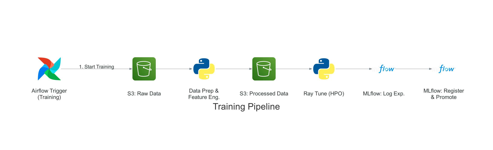
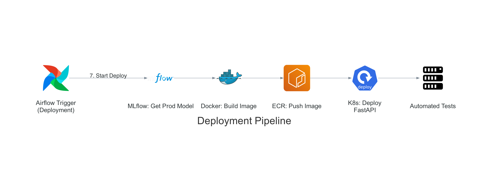

# Health Predict: End-to-End MLOps System for Patient Readmission Prediction


## Overview

**Health Predict** is a comprehensive MLOps system designed to predict the risk of patient readmission in healthcare settings. This project implements a complete machine learning lifecycle from data ingestion to automated retraining, with a focus on robust MLOps practices and production-grade deployment.

This system addresses the critical healthcare challenge of patient readmission, which not only burdens healthcare systems financially but also indicates potential gaps in patient care quality. By accurately predicting readmission risk, healthcare providers can implement targeted interventions, improving patient outcomes while optimizing resource allocation.

## Business Problem

Patient readmission—the return of a patient to the hospital shortly after discharge—represents both a significant healthcare quality issue and a financial burden:

- Hospital readmissions cost the U.S. healthcare system approximately $26 billion annually
- Readmissions often indicate unresolved health issues or inadequate post-discharge support
- CMS penalizes hospitals for excessive readmission rates through the Hospital Readmissions Reduction Program
- Early identification of at-risk patients enables proactive interventions

Health Predict addresses this challenge by leveraging machine learning to predict which patients are most likely to be readmitted, allowing for targeted interventions before discharge and during follow-up care.

## Solution Architecture

The Health Predict system implements a complete MLOps lifecycle on AWS infrastructure, employing cost-effective design choices to demonstrate enterprise-level capabilities while maintaining budget efficiency:

*   **Data Pipeline**: Patient data is ingested into S3 and processed by a unified pipeline orchestrated by Airflow on EC2.
*   **Model Development**: Ray Tune handles distributed hyperparameter optimization across multiple model types (XGBoost, Random Forest, Logistic Regression), with experiments and models managed by MLflow.
*   **Quality Gates**: Drift-gated retraining ensures the pipeline only retrains when data distribution changes are detected. A regression guardrail prevents deploying models that degrade performance.
*   **Deployment**: Production models are containerized, stored in ECR, and deployed to a Kubernetes (Minikube) cluster with rolling updates and automated version verification.
*   **Model Serving**: A FastAPI service serves predictions to end-users, with health checks and model metadata endpoints.
*   **Monitoring & Retraining**: Evidently AI performs drift-gated retraining — using KS-test (numeric) and chi-squared (categorical) statistical tests with a 30% drift threshold to control whether retraining proceeds. A Streamlit dashboard provides real-time visibility into drift trends, model performance, and deployment status.


## Technical Implementation

### Unified Training & Deployment Pipeline

The entire ML lifecycle is managed by a single Airflow DAG (`health_predict_continuous_improvement`) that orchestrates everything from drift detection through production deployment:

*   **Drift Detection**: Evidently AI analyzes ~44 features (11 numeric via KS-test, 33 categorical via chi-squared) against the training distribution. High-cardinality diagnostic codes are excluded to reduce noise. If fewer than 30% of features show drift, retraining is skipped.
*   **Training Phase**: When drift is detected, data from all previous batches is combined (cumulative learning), processed through feature engineering, and used by Ray Tune for hyperparameter optimization. MLflow tracks experiments and registers the best-performing model (based on AUC).
*   **Quality Gate**: A regression guardrail compares the new model against the current production model — deployment is blocked if AUC degrades by more than 2%.
*   **Deployment Phase**: The production model is packaged into a Docker container with the FastAPI application, pushed to ECR, and deployed to Kubernetes via a rolling update. Automated verification confirms the deployed model version matches what was promoted.

### Training Pipeline with Hyperparameter Optimization

The training pipeline leverages distributed computing for efficient model development:

- **Orchestration**: Single Airflow DAG manages the end-to-end process
- **Models**: Multiple model types (XGBoost, Random Forest, Logistic Regression)
- **HPO**: Ray Tune with ASHA scheduler for scalable hyperparameter optimization with early stopping
- **Experiment Tracking**: MLflow for logging parameters, metrics, and artifacts
- **Model Selection**: Automated selection of best model based on AUC
- **Model Registry**: Automatic promotion to production in MLflow registry



### Deployment Pipeline

The deployment pipeline automates the transition from model training to production:

- **Regression Guardrail**: New model must not degrade AUC by more than 2% vs. production
- **Container Building**: Automated Docker image building with the latest model
- **Registry**: Pushing versioned images to Amazon ECR
- **Kubernetes Deployment**: Rolling updates for zero-downtime deployments
- **Version Verification**: Automated check that deployed API serves the correct model version
- **Health Monitoring**: Readiness and liveness probes on the prediction API



### Model Serving API

The model serving API provides reliable and efficient prediction services:

- **Framework**: FastAPI for high-performance REST API
- **Documentation**: Auto-generated Swagger/OpenAPI docs
- **Model Loading**: Dynamic loading from MLflow registry
- **Preprocessing**: Consistent preprocessing pipeline with the training process
- **Model Metadata**: `/model-info` endpoint for deployment verification
- **Health Checks**: Endpoint for K8s readiness/liveness probes

### Drift Detection & Retraining

The monitoring system ensures model performance over time:

- **Data Partitioning**: 20% of data for initial training, 80% reserved to simulate future data across 5 batches with intentional drift profiles
- **Drift Detection**: Evidently AI with KS-test for numeric features and chi-squared for categorical features
- **Drift-Gated Retraining**: Pipeline only retrains when 30%+ of features show drift; stable data skips retraining entirely
- **Override**: `force_retrain` parameter available to bypass the drift gate when needed
- **Visualization**: Streamlit dashboard for tracking drift metrics, model performance, and deployment status

### CI/CD Architecture

The system uses a dual-pipeline approach: **GitHub Actions** handles software CI/CD (test, build, push, deploy on code changes), while **Airflow** handles ML CI/CD (drift detection, retraining, model promotion on data events). Both pipelines can deploy independently to the same Kubernetes cluster.

## Key Technologies

The project leverages a diverse technology stack:

- **AWS Services**: EC2, S3, ECR
- **Containerization**: Docker, Docker Compose, Kubernetes (Minikube)
- **MLOps Tools**: MLflow, Apache Airflow, Evidently AI
- **Machine Learning**: Scikit-learn, XGBoost, Ray Tune
- **API Development**: FastAPI, Pydantic
- **Data Processing**: Pandas, NumPy
- **Monitoring**: Streamlit
- **CI/CD**: GitHub Actions
- **Infrastructure as Code**: Terraform

## Results & Achievements

- **Performance**: Models achieve 64%+ AUC in predicting patient readmission on highly imbalanced healthcare data
- **Automation**: 100% automated pipeline from data ingestion to production deployment
- **Intelligence**: Drift-gated retraining prevents unnecessary model updates when data is stable
- **Reliability**: Zero-downtime deployments with Kubernetes rolling updates and automated version verification
- **Monitoring**: Real-time drift detection and model performance tracking via Streamlit dashboard
- **Compliance**: Complete model lineage tracking and reproducibility through MLflow

## Getting Started

### Prerequisites

- AWS Account with appropriate permissions
- Docker and Docker Compose installed
- Terraform installed (for infrastructure provisioning)
- Minikube installed (for local Kubernetes deployment)

### Quick Start

1. **Infrastructure Setup**
   ```bash
   cd iac
   terraform init
   terraform apply
   ```

2. **MLOps Services Startup**
   ```bash
   ./scripts/start-mlops-services.sh
   ```

3. **Run the Pipeline**
   - Access Airflow UI at http://<EC2_PUBLIC_IP>:8080
   - Trigger the `health_predict_continuous_improvement` DAG with config: `{"batch_number": 1}`
   - The pipeline handles drift detection, training, quality gates, and deployment automatically

4. **Monitor & Access**
   - Prediction API at http://<MINIKUBE_IP>:<NODE_PORT>
   - MLflow UI at http://<EC2_PUBLIC_IP>:5000
   - Monitoring Dashboard at http://<EC2_PUBLIC_IP>:8501

## Future Enhancements

- **A/B Testing**: Automated comparison of model versions in production with traffic splitting
- **Explainability**: Integration of SHAP or LIME for model interpretability in clinical settings
- **Advanced Drift Metrics**: Add PSI and Wasserstein distance for more granular drift sensitivity
- **Real-time Streaming**: Kafka integration for processing patient data streams as they're generated
- **Feature Store**: Dedicated feature store (e.g., Feast) for feature versioning and serving consistency
- **Automated Rollback**: Production monitoring that triggers automatic rollback on performance regression

## Conclusion

Health Predict demonstrates a comprehensive MLOps approach to healthcare predictive modeling, showcasing the entire machine learning lifecycle from data preparation to production monitoring and automated retraining. The system balances sophisticated ML capabilities with cost-effective infrastructure choices, making it both powerful and practical for real-world healthcare applications.

This project highlights the critical intersection of machine learning and healthcare, providing a tool that not only predicts patient outcomes but does so within a robust framework that ensures reliability, scalability, and adaptability over time.

---

*Note: This project was developed as a demonstration of MLOps capabilities and healthcare ML applications. While the models are trained on real healthcare data, this system is not intended for clinical use without proper medical validation and regulatory approval.*
